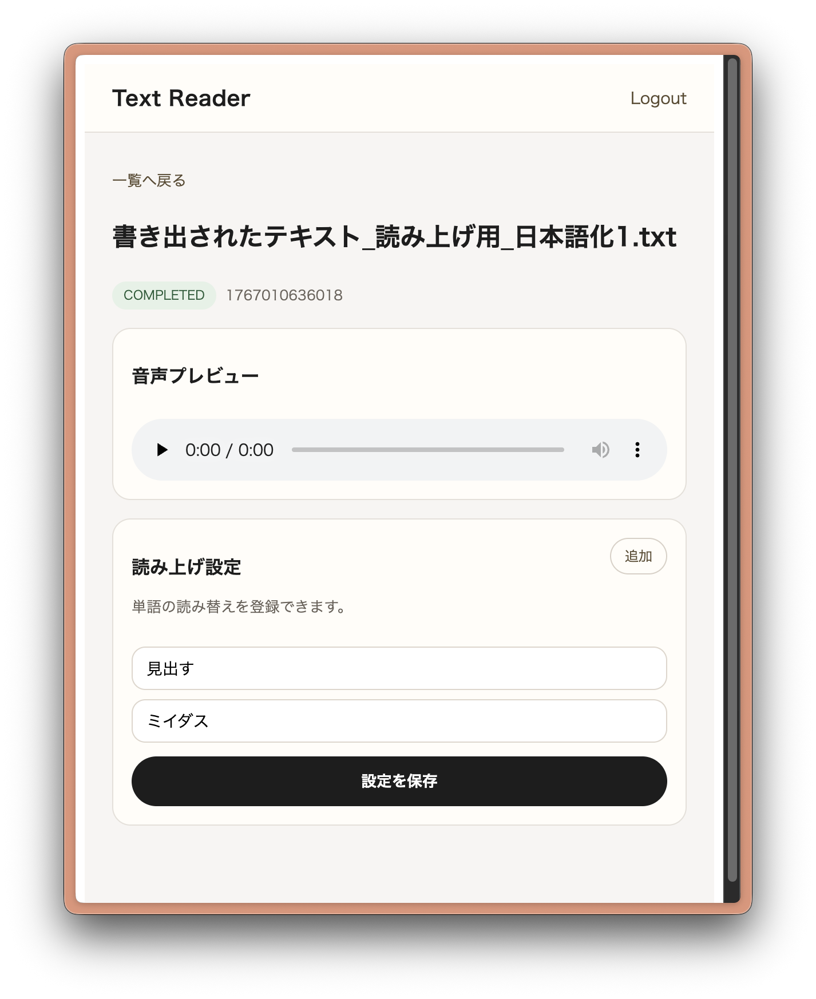
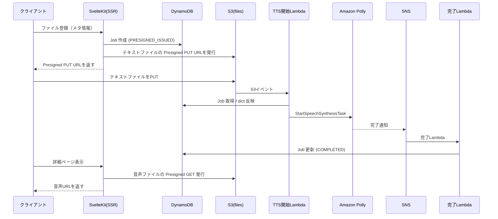

# Text Reader

テキストをアップロードして読み上げ音声を生成・再生できるアプリです。Cognito 認証、DynamoDB のジョブ管理、S3 直アップロード、Polly による音声生成を利用します。



## 技術スタック

- パッケージマネージャー: pnpm
- フロントエンド: SvelteKit（SSR, TypeScript）
- 認証: Cognito Hosted UI（Google IdP）
- インフラ: AWS CDK（TypeScript）
- データストア: DynamoDB
- ストレージ: S3（直アップロード）
- 音声生成: Amazon Polly + SNS

## ディレクトリ構成

```text
.
├─ src/
│  ├─ lib/
│  │  └─ server/
│  │     ├─ auth/        # Cognito/OIDC, PKCE, Cookie
│  │     └─ aws/         # DynamoDB/S3/Lambda クライアント
│  ├─ routes/            # ルーティング（ログイン/ジョブ一覧/詳細/登録など）
│  └─ hooks.server.ts    # 認証セッション処理
├─ cdk/
│  ├─ bin/               # CDK エントリ
│  ├─ lib/               # CDK スタック定義
│  └─ lambdas/           # Polly開始/完了など
├─ scripts/              # ECR push スクリプト
└─ static/               # 静的アセット
```

## シーケンス図



## 環境変数（ローカル）

`.env` に最低限以下を設定します。

```sh
AWS_REGION=ap-northeast-1
JOBS_TABLE_NAME=TextReaderStack-...
FILES_BUCKET_NAME=... 
COGNITO_DOMAIN=https://auth.example.com
COGNITO_CLIENT_ID=... 
COGNITO_ISSUER=https://cognito-idp.ap-northeast-1.amazonaws.com/...
PUBLIC_APP_ORIGIN=http://localhost:5173
TTS_START_FUNCTION_NAME=TextReaderStack-TtsStartFunction...
```

## CDK デプロイ

基本は以下の順序で進めます。

```sh
pnpm -C cdk deploy:ecr
GOOGLE_CLIENT_SECRET=your-secret pnpm -C cdk deploy:secrets
GOOGLE_CLIENT_ID=your-client-id FRONTEND_IMAGE_TAG=latest pnpm -C cdk deploy:app
```

### カスタムドメイン（例: text-reader.app.hr20k.com）

CloudFront と Cognito のカスタムドメインは us-east-1 の ACM を使います。

1) ECR
```sh
pnpm -C cdk deploy:ecr
```

2) Lambda@Edge
```sh
pnpm -C cdk deploy:lambda-edge
```

3) ACM（CloudFront + Cognito）
```sh
pnpm -C cdk deploy:acm \
  -c hostedZoneId=Z002217135CBSLLD4NG0R \
  -c hostedZoneName=app.hr20k.com \
  -c customSubdomain=text-reader \
  -c cognitoSubdomain=auth.text-reader
```

4) Secrets（Google OAuth クライアントシークレット）
```sh
GOOGLE_CLIENT_SECRET=your-secret pnpm -C cdk deploy:secrets
```

5) App（ACM, Lambda@Edge の ARN を指定）

`deploy:lambda-edge` で取得した Lambda@Edge の Arn を使用する。

```sh
GOOGLE_CLIENT_ID=your-client-id FRONTEND_IMAGE_TAG=2024-09-01 pnpm -C cdk deploy:app \
  -c hostedZoneId=Z002217135CBSLLD4NG0R \
  -c hostedZoneName=app.hr20k.com \
  -c customSubdomain=text-reader \
  -c certificateArn=arn:aws:acm:us-east-1:... \
  -c cognitoDomainName=auth.text-reader.app.hr20k.com \
  -c cognitoCertificateArn=arn:aws:acm:us-east-1:... \
  -c lambdaEdgeArn=arn:aws:lambda:us-east-1:...
```

### Google OAuth 設定

- Google OAuth（Web）クライアントの Authorized redirect URI に以下を設定します。
  - `https://<cognito-domain>/oauth2/idpresponse`
  - 例: `https://auth.text-reader.app.hr20k.com/oauth2/idpresponse`

## フロントエンドイメージの ECR への push

スクリプトは `TextReaderEcrStack` の出力から ECR URI を解決します。

```sh
AWS_REGION=ap-northeast-1 ./scripts/push-frontend-image.sh
AWS_REGION=ap-northeast-1 ./scripts/push-frontend-image.sh 2024-09-01
AWS_REGION=ap-northeast-1 STACK_NAME=TextReaderEcrStack ./scripts/push-frontend-image.sh 2024-09-01 linux/arm64
```
